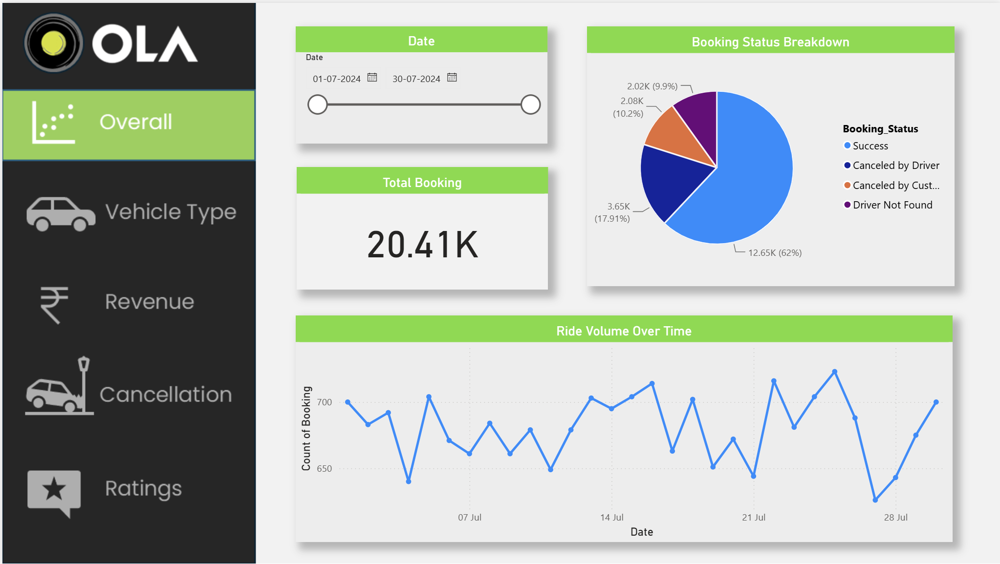
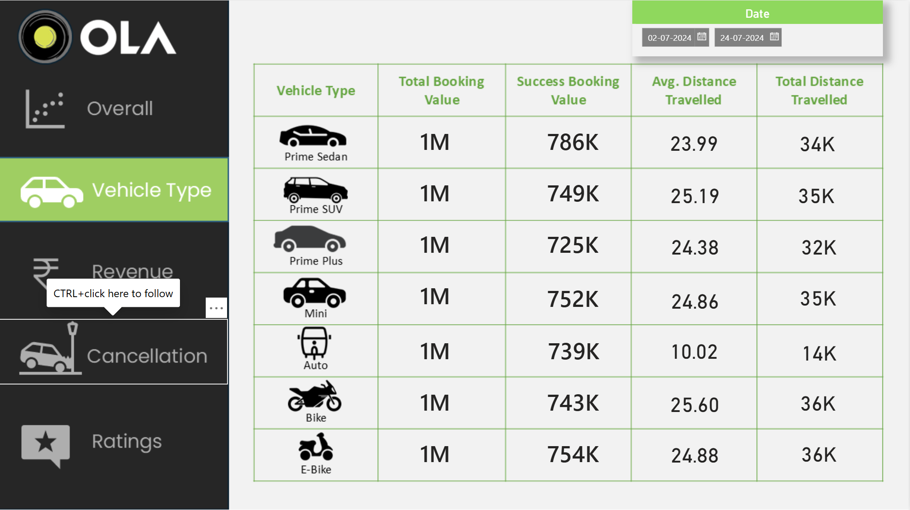
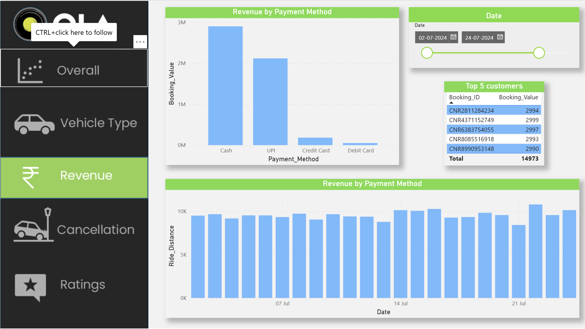
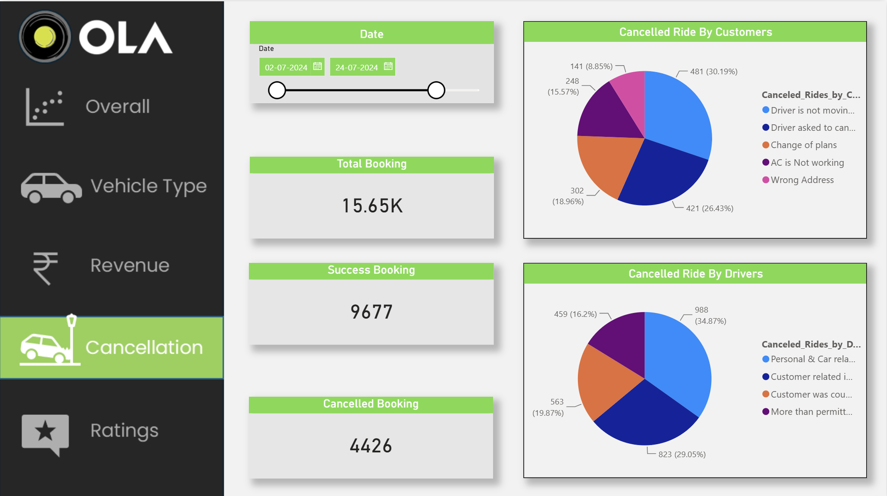
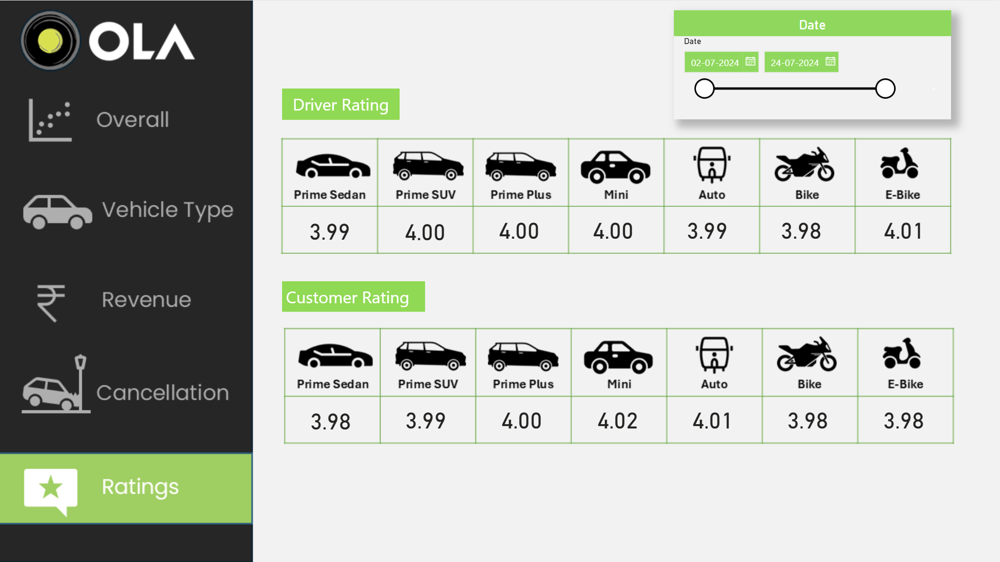

# Ola Ride Booking Analysis – SQL & Power BI

# Project Overview
This project analyzes Ola ride booking data using SQL and Microsoft Power BI.
SQL was used to analyze the data and extract useful business insights. Power BI was used to create an interactive dashboard for analyzing bookings, revenue, cancellations, vehicle types, and customer and driver ratings.

# Objectives
- Analyze overall ride booking performance.
- Analyze successful and cancelled bookings.
- Compare different vehicle types.
- Analyze revenue by payment method.
- Identify customer and driver cancellation reasons.
- Analyze customer and driver ratings.
- Analyze ride volume over time.
- Extract useful business insights from the data.

# Dashboard Pages

# 1. Overall Analysis
Provides an overview of booking status, total bookings, and ride volume over time.

# 2. Vehicle Type Analysis
Compares:
- Prime Sedan
- Prime SUV
- Prime Plus
- Mini
- Auto
- Bike
- E-Bike

The analysis includes booking value, successful booking value, average distance, and total distance travelled.

# 3. Revenue Analysis
Analyzes:
- Revenue by payment method
- Cash
- UPI
- Credit Card
- Debit Card
- Ride distance over time
- Top customers

# 4. Cancellation Analysis
Analyzes:
- Total bookings
- Successful bookings
- Cancelled bookings
- Customer cancellation reasons
- Driver cancellation reasons

# 5. Ratings Analysis
Compares:
- Driver ratings by vehicle type
- Customer ratings by vehicle type

# Key KPIs
- Total Booking
- Successful Booking
- Cancelled Booking
- Total Booking Value
- Successful Booking Value
- Average Distance Travelled
- Total Distance Travelled
- Driver Rating
- Customer Rating

# Tools & Technologies
- SQL
- Microsoft Power BI
- Power Query
- DAX
- Data Analysis
- Data Visualization

# SQL Analysis
SQL was used for:
- Booking status analysis
- Revenue analysis
- Payment method analysis
- Vehicle type analysis
- Cancellation analysis
- Customer analysis
- Rating analysis
- Date-based analysis

## Dashboard Preview

# Overall Analysis

# Vehicle Type Analysis

# Revenue Analysis

# Cancellation Analysis

# Ratings Analysis

# Skills Demonstrated
SQL | Power BI | DAX | Power Query | Data Analysis | Data Visualization | Business Intelligence

# Author
Jay Kumar Raj
B.Tech Computer Science  
Aspiring Data Analyst
